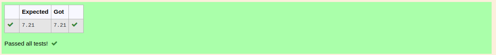

# DISTANCE-BETWEEN-TWO-POINTS

## AIM:
To write a python program to find the distance between two points

## ALGORITHM:
### Step 1: 
Importing math to do mathematical tasks

### Step 2: 
Assign the two values 

### Step 3: 
Substitute the values in the distance formula  


### Step 4: 
Print the output

### Step 5: 
End the program

### PROGRAM:
```
#Program to find the distance between two points.
#Developed by: Santhosh U
#RegisterNumber:22009224
import math
a=[10,6]
b=[4,2]
distance=math.sqrt(((b[0]-a[0])**2)+((b[1]-a[1])**2))
print("{:.2f}".format(distance))  
```

### OUTPUT:


### RESULT:
python program to find the distance between two points is executed successfully